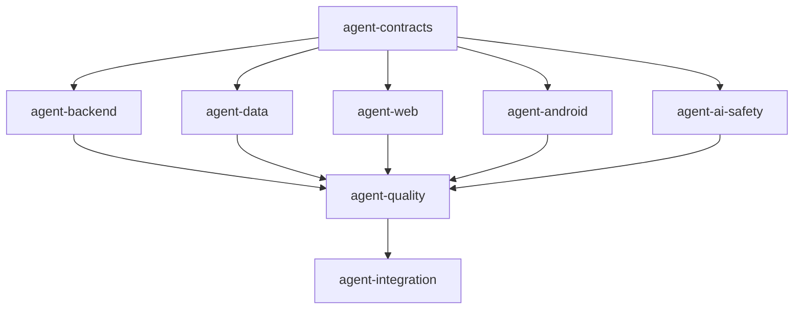

# Repository Assessment

## Current Status

- **Branch**: `main` at commit `473dcb7`
- **Content**: Design documents only — no implementation code exists
- **Structure**: 7 documentation directories (`00-overview/` through `07-delivery/`), plus `compose.yaml`, `.env.example`, `.gitignore`

## Detected Technology Stack

### Infrastructure (from compose.yaml)
| Service | Image | Port |
|---------|-------|------|
| PostgreSQL/PostGIS | `postgis/postgis:16-3.4` | 5432 |
| Redis | `redis:7-alpine` | 6379 |
| MinIO | `minio/minio:latest` | 9000/9001 |
| OpenSearch | `opensearch:2` | 9200 |

### Container Runtime
- **Podman** 6.0.1 (no Docker)

### Development Environment
- **Node.js** v24.16.0
- **npm** 12.0.1
- **pnpm** via npx (11.14.0)
- **No Java/Kotlin/Gradle** — Android compilation will require SDK installation or will produce source-only output

### AI Provider
- FPT AI Factory (OpenAI-compatible API)
- Models: Qwen/Qwen3-32B (text), Qwen/Qwen2.5-VL-7B-Instruct (vision/OCR)

## Missing Implementation Areas

Everything. The repository contains only system-design documents. The following must be built:

1. Monorepo workspace structure
2. Shared contracts package
3. Backend API (modular monolith)
4. Database migrations and seed data
5. Responsive web application
6. Android application (Kotlin/Compose)
7. AI provider adapter, Price Engine, Safety Engine
8. Linting, formatting, type-checking configuration

## Scaffold Decisions

| Decision | Choice | Rationale |
|----------|--------|-----------|
| Package manager | pnpm (via npx) | Workspace support, fast installs |
| Backend framework | Fastify | Lighter than NestJS, fits modular monolith |
| Validation | Zod | Runtime + TypeScript inference |
| Web framework | Next.js | SSR for public content, API routes |
| Test framework | Vitest | Fast, TypeScript-native |
| Logging | pino | Structured JSON, Fastify integration |
| Database migrations | node-pg-migrate | Simple, SQL-based |
| Android | Source-only scaffold | No JDK available in environment |

## Planned Agents

| Wave | Agent | Branch | Scope |
|------|-------|--------|-------|
| 0 | agent-contracts | `agent/contracts` | Monorepo setup, shared types, linting |
| 1 | agent-backend | `agent/backend` | Fastify API, health, places, posts |
| 1 | agent-data | `agent/data` | Migrations, seeds, repository adapters |
| 1 | agent-web | `agent/web` | Next.js responsive web |
| 1 | agent-android | `agent/android` | Kotlin/Compose project scaffold |
| 1 | agent-ai-safety | `agent/ai-safety` | AI provider, Price Engine, Safety Engine |
| 2 | agent-quality | `agent/quality` | Review, security scan, missing tests |
| 2 | agent-integration | `agent/integration` | Cherry-pick, resolve conflicts, smoke tests |

## Agent Dependencies

## Initial File Ownership

| Agent | Owned Paths |
|-------|-------------|
| contracts | `package.json`, `pnpm-workspace.yaml`, `tsconfig*.json`, `eslint*`, `prettier*`, `packages/contracts/**`, `packages/config/**`, `packages/testing/**`, `docs/coordination/shared-decisions.md` |
| backend | `apps/api/**` (except `modules/ai`, `modules/price`, `modules/safety`) |
| data | `apps/api/src/modules/data/**`, `scripts/db/**`, `migrations/**`, `seeds/**`, compose infrastructure additions |
| web | `apps/web/**` |
| android | `apps/android/**` |
| ai-safety | `packages/ai-provider/**`, `packages/price-engine/**`, `packages/safety-engine/**`, `packages/testing/src/fakes/ai*` |
| quality | Additional test files, `docs/coordination/quality-report.md` |
| integration | `docs/coordination/integration-report.md`, integration-only changes |
